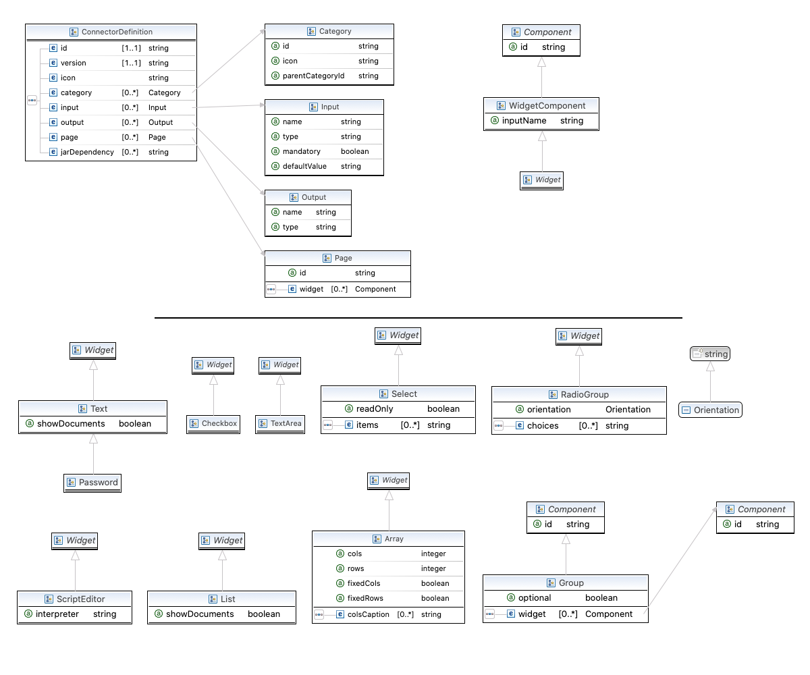

## How to create a custom connector apart from the Bonita Studio

Bonita offers the possibility to create au plug custom connectors, to allow you to connect with any external system you may need.  
A maven archetype is available on maven central to help you to bootstrap a connector project apart from the Bonita Studio. The source code of the archetype is available [here](https://github.com/bonitasoft/bonita-connector-archetype).

### Prerequisite

 1. Java must be installed: [https://adoptopenjdk.net/index.html](https://adoptopenjdk.net/index.html)
 2.  Maven must be installed: [https://maven.apache.org/install.html](https://maven.apache.org/install.html)
 3. Developing a connector apart from the Bonita Studio requires some software development skills. The  archetype offers the possibility to develop the connector in Java, Groovy or Kotlin. Make sure that you are comfortable with at least one of those three languages. 

### Create a Bonita connector project using the maven archetype

A maven archetype is a maven project templating toolkit (_[more details here](https://maven.apache.org/archetype/index.html)_). This archetype allows you to bootstrap a Bonita connector project on your file system. A Bonita connector project is a maven project. It can be built, and then imported into a Bonita Studio to be used.  

Before to create your project, you have to define: 

 - The **groupId** of your connector
     _used as a maven groupId_
 - The **artifactId** of your connector
    _used as a maven artifactId_
 - The **version** of your connector
    _used as a maven version_
 - The **name** of your connector
 - The targeted **Bonita version**: 
    A Bonita connector project depends on _org.bonitasoft.engine:bonita-common_. To avoid potential conflicts / errors at runtime, you should use the Bonita version of your runtime environment.
 - The **language** used in your project. Available values: 
     - java (_default_)
     - groovy
     - kotlin


To create your connector project, prompt a terminal and enter the following command: 
::: warning
**Warning:** Make sure that you are not executing the command from an existing maven project.
:::
```
mvn archetype:generate -DarchetypeGroupId=org.bonitasoft.archetypes -DarchetypeArtifactId=bonita-connector-archetype -DarchetypeVersion=1.0.0 -DgroupId=[YOUR GROUP ID] -DartifactId=[YOUR ARTIFACT ID] -Dversion=[YOUR VERSION] -DconnectorName=[YOUR CONNECTOR NAME] -DbonitaVersion=[TARGET BONITA VERSION] -Dlanguage=[YOUR LANGUAGE]
```
A folder name _[your artifact id]_ containing your project should be created. This connector project can already be built, imported and used in a process.


### Connector developpment

In this section we'll look into the different component of a connector project, and how you should use them to develop your connector.

#### Connector definition
A connector is first defined by its **definition**.  It is an XML file located in _src/main/resources/[connector name].def_ by default.  
The XSD is available in _schemas/connector-definition-descriptor.xsd_, you can import it in a IDE to get completion. 





Example: 
``` xml
<?xml version="1.0" encoding="UTF-8"?>
<definition:ConnectorDefinition xmlns:xsi="http://www.w3.org/2001/XMLSchema-instance" xmlns:definition="http://www.bonitasoft.org/ns/connector/definition/6.1">
    <id>myConnector</id>
    <version>1.0.0</version>
    <icon>connector.png</icon> 
    <category icon="connector.png" id="Custom"/>
  
    <!-- Connector inputs -->
    <input mandatory="true" name="defaultInput" type="java.lang.String"/>
    
    <!-- Connector outputs -->
    <output name="defaultOutput" type="java.lang.String"/>
    
    <!--
       Pages and widgets to use the connector in the Bonita Studio.
       - Each widget must be bound to an input
       - Page titles must be defined in the properties files
       - Widget labels must be defined in the properties files
       - Page and widget descriptions can be defined in the properties files (optional)
    -->
    <page id="defaultPage">
        <widget xsi:type="definition:Text" id="defaultInputWidget" inputName="defaultInput"/>
    </page>
  
</definition:ConnectorDefinition>
```